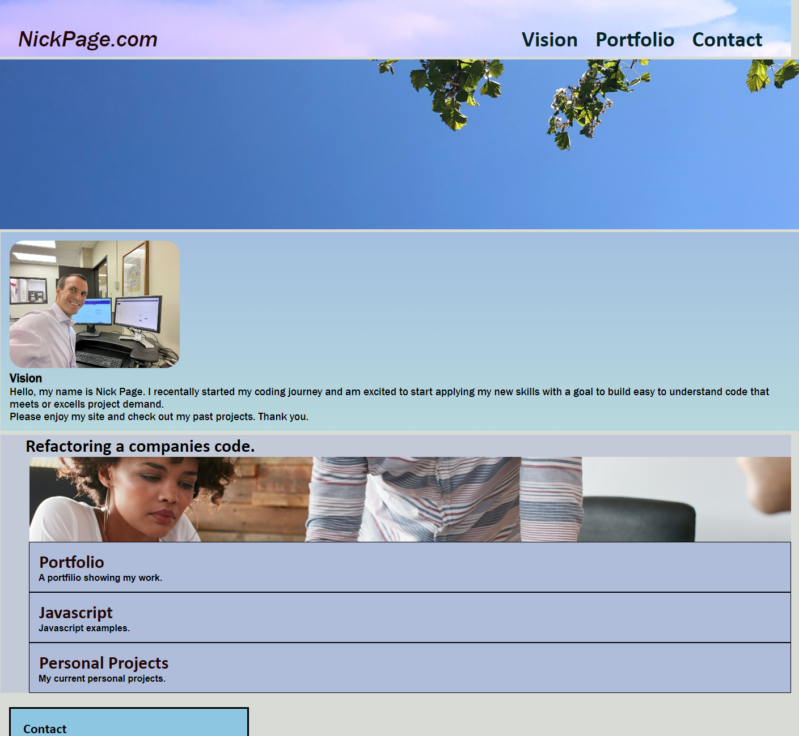

# Portfolio

https://dizzymouse0.github.io/portfolio/

## Project description: 
A profile page that showcases my previous work.

### Why I want to learn how to program.
    I've always enjoyed my time on the computer, either by gaming, designing, or even building PC's themselves; it's always fascinated me. I'm beginning to understand how computer languages work, and I look forward to continuing my journey toward becoming a better coder.

## Credits
Nikki, my tutors, and my wonderful classmates.
### Additional Resources:
Slack-Rescources,
W3 Schools Tutorials,
MDN Tutorials.